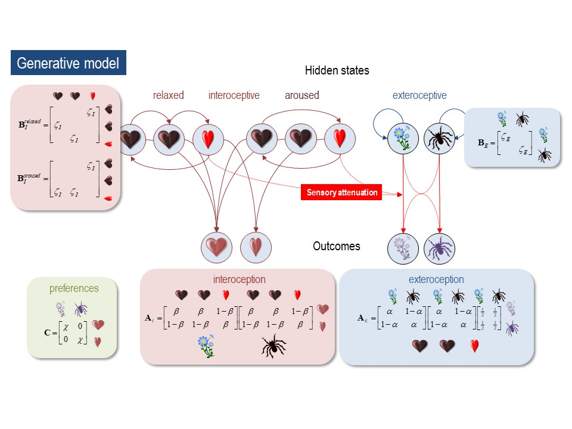

# cardiac-active-inference

Repository containing all of the code needed to reproduce our simulations and figures. 

# In the Body's Eye: The Computational Neuroanatomy of Interoceptive Active Inference

# Abstract
A growing body of evidence indicates that exteroceptive perception is intricately linked to the rhythmic activity of the visceral body. In parallel, interoceptive inference theories of emotion and self-consciousness are on the rise in cognitive science.  However, thus far no formal theory has emerged to integrate these twin domains; instead most extant work is conceptual in nature. Here we introduce a formal model of cardiac active inference, which explains how ascending cardiac signals entrain exteroceptive sensory perception and confidence. Through simulated psychophysics, we reproduce the defensive startle reflex and commonly reported effects linking the cardiac cycle to fear perception. We further show that simulated 'interoceptive lesions' blunt fear expectations, induce psychosomatic hallucinations, and exacerbate metacognitive biases. Through synthetic heart-rate variability analyses, we illustrate how the balance of arousal-priors and visceral prediction errors produces idiosyncratic patterns of physiological reactivity. Our model thus raises the possibility to computationally phenotype disordered brain-body interaction. 

[link to preprint](https://peerj.com/preprints/27137/?td=bl)