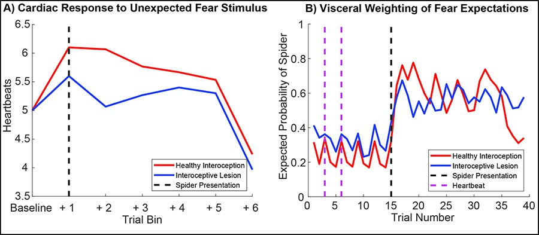
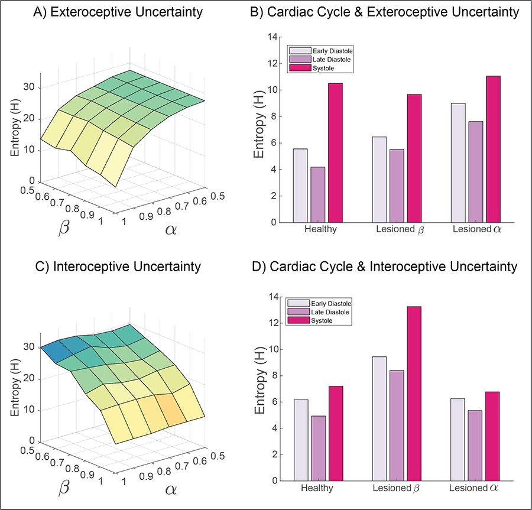

# cardiac-active-inference

This repository contains all of the code needed to reproduce our simulations and figures, as part of our manuscript on active inference and interoception: 

## In the Body's Eye: The Computational Neuroanatomy of Interoceptive Active Inference
## Abstract
>A growing body of evidence indicates that exteroceptive perception is intricately linked to the rhythmic activity of the visceral body. In parallel, interoceptive inference theories of emotion and self-consciousness are on the rise in cognitive science.  However, thus far no formal theory has emerged to integrate these twin domains; instead most extant work is conceptual in nature. Here we introduce a formal model of cardiac active inference, which explains how ascending cardiac signals entrain exteroceptive sensory perception and confidence. Through simulated psychophysics, we reproduce the defensive startle reflex and commonly reported effects linking the cardiac cycle to fear perception. We further show that simulated 'interoceptive lesions' blunt fear expectations, induce psychosomatic hallucinations, and exacerbate metacognitive biases. Through synthetic heart-rate variability analyses, we illustrate how the balance of arousal-priors and visceral prediction errors produces idiosyncratic patterns of physiological reactivity. Our model thus raises the possibility to computationally phenotype disordered brain-body interaction. 

## [Read the Preprint!](https://www.biorxiv.org/content/10.1101/603928v1)

## Figure 2: Generative Model of Cardiac Active Inference
>This schematic illustrates how hidden states cause each other and sentenced outcomes in the interoceptive and exteroceptive domain. The upper row describes the probability transitions among hidden states, while the lower row specifies the outcomes that would be generated by combinations of hidden states that are inferred on the basis of outcomes. The green panel specifies the models prior preferences; namely, the sorts of outcomes it expects to encounter. Please see main text for a full explanation. Although this figure portrays interoceptive and exteroceptive outcomes as separate modalities, they were in fact modelled as combinations - so that the prior preferences could be evaluated (this is necessary because the preferred physiological outcome depends upon the visual cue). In this model, the precisions are denoted by Greek letters and control the fidelity of various probabilistic mapping is (i.e., the likelihood or A matrices and the transition or B matrices).

 
 

## Figure 3: Simulated Physiology and Perceptual Inference
> To establish the criterion validity of our model, we first set out to reproduce some basic psychophysiological phenomenology, and to compare how these phenomena change under 'healthy' (i.e., normative) versus 'visceral lesion' parameter settings. To do so, we fed the agent a fixed sequence of cardiac and exteroceptive stimuli, such that the first 14 trials constituted a 'baseline' period of cardiac quescience (i.e., a steady heart rate) in the absence of arousing stimuli. On the 15th trial, an unexpected arousing stimulus (a 'spider') is presented and a further 85 trials simulated without constraining the generative model. This simulation was repeated for 60 simulated participants each with randomized starting values, half of which had 'lesioned' interoceptive precision (?? = 0.5, blue lines). Under these conditions the agent exhibits a clear 'startle' or 'defense' reflex (Graham and Clifton, 1966; Sokolov, 1963), characterized by an immediate heart-rate acceleration (left panel) and a dramatic shift in its posterior expectation of encountering another threatening stimulus. Interestingly, during the baseline period the posterior expectation of encountering a threat stimulus oscillates directly with the heartbeat; the lesioned agent shows both an attenuation of the cardiac response and a blunted belief update. Note that for the right panel, only trials 1-40 are shown; trials beyond the baseline period should be interpreted with caution. On the left, blue lines show summed heartbeats (time spent in systole) for 15-trial bins; on the right, lines depict the median posterior probability that the agent will see a spider on the next trial. 

 
 

## Figure 4: Simulating the influence of interoceptive and exteroceptive precision on metacognitive uncertainty. 
>To explore how interoceptive inference influences metacognition, we measured the summed entropy of beliefs for both exteroceptive (top panels) and interoceptive (bottom panels) states. By simulating the full range of sensory precision values, from lesioned precision (?? or ?? = 0.5) to 'hyper-precision' (?? or ?? = 1), the predominant pattern of interaction is revealed. A) For exteroceptive inferences (i.e., the agent's belief that a spider or flower is present), the principle entropy gradient is characterized by reductions in exteroceptive precision. This effect is modulated in part by interoceptive precision; for example, the lowest uncertainty is obtained when interoceptive and exteroceptive precision are maximal. B) Separating exteroceptive uncertainty by each phase of the cardiac cycle reveals a clear effect of the heartbeat on belief entropy, which is modulated most strongly by lesioning the precision of exteroceptive predictions. Lesioning interoceptive uncertainty does raise the overall level of exteroceptive uncertainty, but to a lesser degree. Note that altering exteroceptive precision only affects the diastolic phases (as precision is already attenuated during systole). Interoceptive lesions preclude precise inferences about the cardiac phase, so reduce the discrepancy in uncertainty between these phases. C) Similar to exteroceptive belief, interoceptive metacognition is predominately influenced by interoceptive precision. D) The cardiac cycle also modulates the overall uncertainty of interoceptive beliefs; this effect is greatly increased when interoceptive precision is lesioned. Interestingly, exteroceptive lesions primarily reduce the differentiation between cardiac states. 

 
 

## Figure 5: Synthetic Heart-Rate Variability (HRV) and Interoceptive Computational Phenotyping
>To illustrate the potential of our approach as a generative model of physiological reactivity, we produced synthetic heartbeat traces and analyzed these with a standard time-frequency approach under various canonical parameter settings. A) Synthetic ECG traces produced by convolving a standard QRS-wave function with systole events generated by our model.  B) These where then transformed into RR-intervals by assuming an 350ms sampling rate, C) Power spectra of RR-intervals were calcualted using Welch's method and categorized as ultra-low (ULF), low, (LF), high (HF), and very high frequency (VHF) bands for each simualted agent. Physiological responses were then summarized in terms of beats-per-minute (BMP) and sympathovagal balance (ratio of area under curve for each frequency band, aLF/aHF) (Malliani et al., 1991). To illustrate the potential of our approach for interoceptive computational phenotyping, we simulated three different agents - one with healthy interoceptive inference (bottom left), another with hyper-precise visceral sensations (bottom middle), and another with hyper-precise priors for the aroused (sympathetic) policy (bottom right). These each produce unique interoceptive inference 'fingerprints', i.e., the individual patterns of heart-rate variability produced by these parameter settings. In this example, hyper-precise visceral sensations reduce heart-rate and shift overall peak frequency to the high-frequency domain, whereas hyper strong arousal priors induce strong heart-rate acceleration coupled with attenuated ultra-low and ultra-fast oscillations. In the future, these idiosyncratic patterns could be used to identify maladaptive interoceptive inference from heart-rate data. 

 
 

## Figure 6: the computational neuroanatomy of cardiac active inference
>A proposed computational neuroanatomy of interoception. The schematic above shows the form of the neuronal message passing implied by active inference for the generative model depicted in Figure 2. We have related this to the anatomical networks that could implement these inferences. The sensory observations in our simulations are visual and interoceptive (cardiac). These sensations are carried by cranial nerves II and IX respectively. Cranial nerve II targets the superior colliculus in the midbrain. This structure sends short latency visual data to the amygdala, which is well placed to make inferences about emotionally salient stimuli. The amygdala additionally receives visual data from the ventral visual stream in the temporal lobe. Cranial nerve IX carries information from the carotid sinus baroreceptors to the nucleus tractus solitarus in the brainstem. This nucleus communicates with the posterior insula (via thalamic and PAG relays); the anterior cingulate monitors and controls the precision of this ascending visceral information via neuromodulation, possibly via feedback through noradrenergic pathways (not shown). The posterior insula and amygdala interact with one another but also project to the anterior insula. This targets the nucleus ambiguus (via brainstem relays such as the periaqueductal gray), which gives rise to the vagus (X) nerve. The vagus nerve targets neurons in the cardiac plexus that project to both the sinoatrial node and the atrioventricular node of the heart, slowing its rhythm. The nucleus tractus solitarus additionally participates in a reflex loop implicating the sympathetic control of the cardiac cycle, but this is omitted for simplicity. The functional anatomy suggested here implies the anterior insula might play a similar computational role in autonomic policy selection to the basal ganglia in selection of policies involving the skeletal muscles (Friston, Rosch et al. 2017). Note that inscribed directed influences (blue arrows), are not assumed to be monosynaptic - for simplicity, many intermediary relay nodes have been omitted. 
